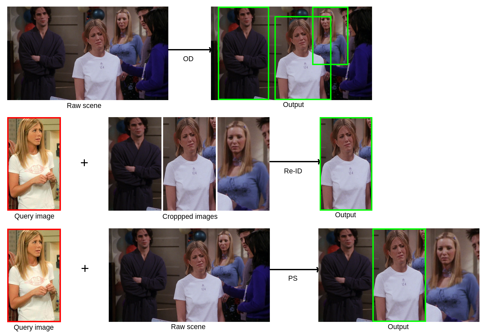
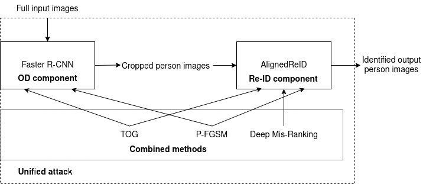
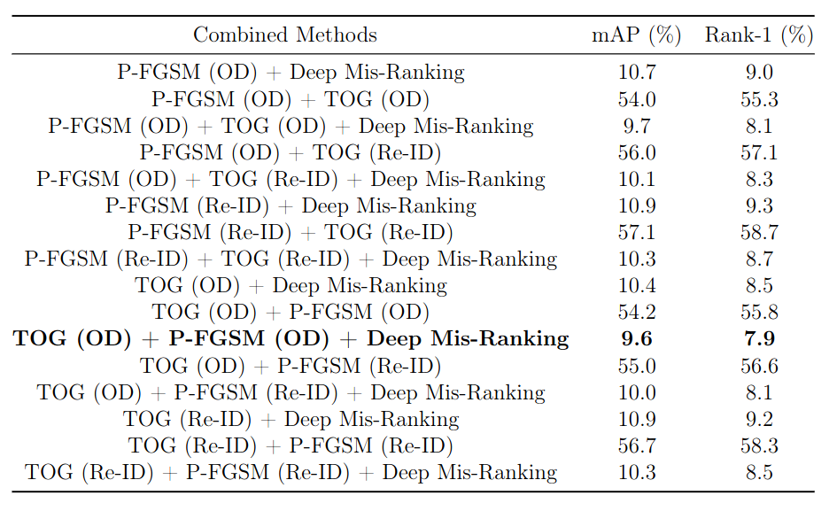
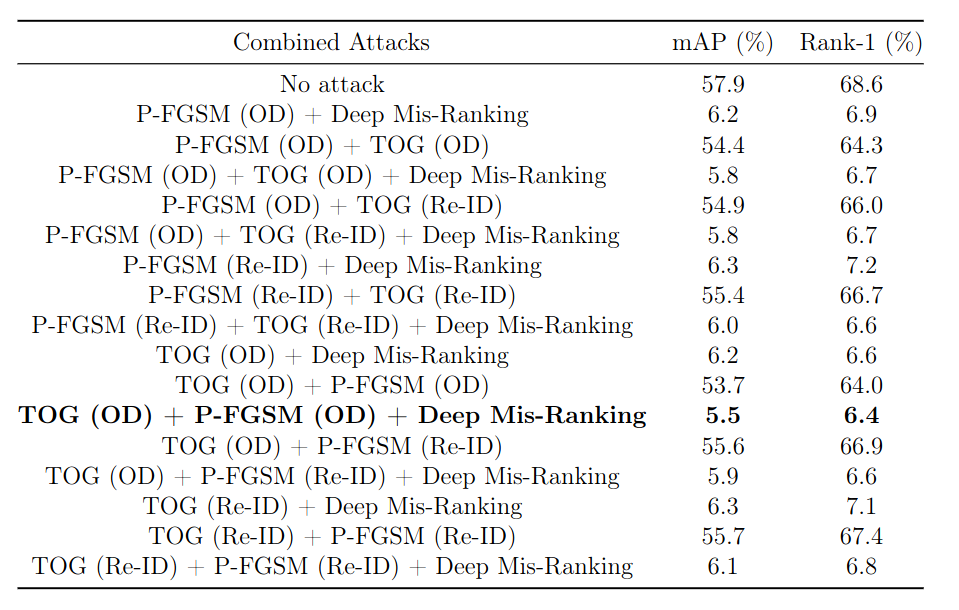

# Unifying Adversarial Attacks on Person Search Systems
This repository contains the script files and additional content of the "Unifying Adversarial Attacks on Person Search Systems" thesis.




## Topics

- [1. Installation](#1-installation)
  - [1.1. Operating System](#11-operating-system)
  - [1.2. Virtual Environment](#12-virtual-environment)
  - [1.3. Dependencies](#13-dependencies)
    - [1.3.1. Targeted adversarial Objectness Gradient VE](#131-targeted-adversarial-objectness-gradient-ve)
    - [1.3.2. Private Fast Gradient Signed Method VE](#132-private-fast-gradient-signed-method-ve)
    - [1.3.3. Deep Mis-Ranking VE](#133-deep-mis-ranking-ve)
    - [1.3.4. Faster R-CNN VE](#134-faster-r-cnn-ve)
- [2. Datasets](#2-datasets)
- [3. Supplementary Material](#3-supplementary-material)
- [4. Scripts](#4-scripts)
  - [4.1. Faster R-CNN VE](#41-faster-r-cnn-ve)
  - [4.2. TOG VE](#42-tog-ve)
  - [4.3. P-FGSM VE](#43-p-fgsm-ve)
  - [4.4. Deep Mis-Ranking VE](#44-deep-mis-ranking-ve)
- [5. Results](#5-results)
- [6. Paper References](#6-paper-references)
- [7. Repository References](#7-repository-references)
- [8. Dataset References](#8-dataset-references)

## 1. Installation

The scripts run in various Virtual Environments (VEs) because of the multiple dependencies with different Python versions. 
`We recommend the use of GPUs` to accelerate the experiment steps.

## 1.1. Operating System

The `Ubuntu 20.04.6 Long-Term Support (LST)` works as the Operating System (OS) for all the scripts. This OS is a 
a stable and reliable Linux distribution designed for extended use, offering security updates and support 
until April 2025, making it ideal for servers, desktops, and critical systems.

## 1.2. Virtual Environment

``Anaconda 24.5.0`` allows the creation of various VEs to run the scripts inside this repository. In our case, 
we created one for each [repository reference](#7-repository-references).

## 1.3. Dependencies

If we create a VE for each [repository reference](#7-repository-references), each has specific dependencies. 
More than that, we also have to install different Python versions in each case. To create an environment in
Anaconda, there is this [documentation](https://docs.conda.io/projects/conda/en/latest/user-guide/tasks/manage-environments.html).

## 1.3.1. Targeted adversarial Objectness Gradient VE

The VE of the Targeted adversarial Objectness Gradient (TOG) consists of the universal adversarial attack that 
effectively deceives Object Detection (OD) systems by forcing them to misclassify or overlook critical objects. 
`We recommend the Python 3.7.16` for the dependencies. To avoid errors, `we also recommend installing the dependencies in the order below`. 
The first dependencies with `conda install` command are:

* numpy==1.18.5
* tqdm==4.49.0
* tensorflow-gpu==1.14.0
* keras==2.2.4
* Pillow==8.8.1
* matplotlib==3.3.2

Follow with `pip install` command (`we recommed the pip 22.3.1`) for the other dependencies:

* torch==1.2.0
* cupy-cuda113==10.6.0

Example of `pip install` command in the VE: `/home/<your_user>/anaconda3/envs/<your_VE_name>/bin/pip install torch==1.2.0`.

P.S.: Pay attention to your CUDA version because it depends on your GPU. `We used GPU Nvidia Quadro P5000` for the experiments. 
The CUDA version for our GPU was `11.3`. Different CUDA versions can alter some package installation versions, like `cupy-cuda`. 
Another problem is when some packages lose support, demanding manual installation. The last time we installed these packages 
was on July 29, 2024.

Again with `conda instal`:

* scikit-image==0.17.2
* torchvision==0.4.0

One more time with `pip install`:

* easydict==1.9

Lastly with `conda install`:

* tensorboardX==2.2
* h5py==2.10.0
* jupyter

## 1.3.2. Private Fast Gradient Signed Method VE

The VE of the Private Fast Gradient Signed Method (P-FGSM) consists of an adversarial attack technique designed to 
generate imperceptible perturbations while preserving privacy, effectively misleading deep learning models with minimal computational overhead. 
`We recommend the Python 2.7.18` for the dependencies. To avoid errors, `we also recommend installing the dependencies in the order below`. 
The first dependencies with `conda install` command are:

* pytorch==0.4.1
* numpy==1.15.4
* torchvision==0.2.1
* tqdm==4.63.0

Follow with `pip install` command (`we recommend the pip 19.3.1`) for the other dependencies:

* opencv-python==4.2.0.32

## 1.3.3. Deep Mis-Ranking VE

The VE of the Deep Mis-Ranking consists of an adversarial attack strategy that manipulates ranking-based models by introducing perturbations, effectively altering the perceived relevance of items in tasks such as Person Re-Identification (Re-ID) and recommendation systems. 
`We recommend the Python 3.7.6` for the dependencies. To avoid errors, `we also recommend installing the dependencies in the order below`. 
The dependencies with `conda install` command are:

* pytorch==0.4.1
* numpy==1.15.4
* matplotlib==3.3.2
* scipy==1.1.0

`We recommend the pip 22.3.1` for any additional packages.

## 1.3.4. Faster R-CNN VE

The VE of the Faster R-CNN consists of a deep learning-based OD framework that efficiently combines region proposal generation and object classification, achieving state-of-the-art performance in speed and accuracy for detecting and localizing objects in images. 
`We recommend the Python 3.8.1` for the dependencies. To avoid errors, `we also recommend installing the dependencies in the order below`. 
The dependencies with `pip install` command (`we recommend the pip 24.0`) are:

* torch==1.10.0+cu113 torchvision==0.11.1+cu113 torchaudio==0.10.0+cu113 -f https://download.pytorch.org/whl/cu113/torch_stable.html
* visdom==0.2.4
* scikit-image==0.21.0
* tqdm==4.66.4
* fire==0.6.0
* ipdb==0.13.13
* matplotlib==3.7.5
* torchnet==0.0.4
* pyzmq==26.0.3
* notebook==7.2.1
* opencv-python==4.10.0.84
* h5py==3.11.0

## 2. Datasets

The two used datasets in the experiments are the Chinese University of Hong Kong and Sun Yat-sen University (`CUHK-SYSU`) and 
Person Re-Identification in the Wild (`PRW`). We can use these datasets in the Person Search (PS) task. Unfortunately, we 
cannot provide the downloads of the datasets because of the author's restrictions, but you can find a way to obtain them
by the official links provided in [Dataset References](#8-dataset-references) or by doing a deeper search on the web. 

Another dataset is only used to train TOG universal attack: PASCAL Visual Object Classes (`VOC`). 
We used the `2007` and `2012` versions of this dataset for this training, and you can also find their download 
link and homepage in [Dataset References](#8-dataset-references).

## 3. Supplementary Material

One of the most necessary supplementary materials is the pre-trained model for AlignedReID. This Re-ID system enhances 
feature alignment between images by focusing on pixel-to-pixel correspondence, achieving improved matching 
accuracy in challenging real-world scenarios. We can use the learned weights from the training done from a dataset like 
`Market-1501`, for instance. You can find this `.pth.tar` file in [Repository References](#7-repository-references) (`Deep Mis-Ranking`).

Another important `.pth` file (`torchvision`) is related to the Faster R-CNN. You can also find this file in [Repository References](#7-repository-references) (`Faster R-CNN`). The weights of this file are pre-trained on the `PASCAL VOC 2007` dataset. Lastly, it 
could be also necessary to download `.h5` files for [TOG VE](#42-tog-ve) script because it contains detectors used for the distractor 
images generation.

## 4. Scripts

Here, we describe the `script execution in each VE` to get the final results. There are related files, but we have to run just some
of them.

## 4.1. Faster R-CNN VE

The first step of the PS pipeline consists of the main notebook, `faster_r_cnn/prw_cuhk_sysu.ipynb` that processes the files of
`PRW` and `CUHK-SYSU` datasets. This processing extracts the detected person from the datasets for later stages of the pipeline. 
`We recommend running the notebook cell by cell` because you will probably need to change some input and output paths, 
and there are separated scripts to equalize the available identities with the person-cropped images.

## 4.2. TOG VE

Depending on the `attack combination` you want to apply, `you can start with TOG or P-FGSM`. The `tog/demo_universal.ipynb` contains the
notebook for executing the universal attack approach. Inside this notebook, we have two preloaded detectors: `YOLOv3_MobileNetV1` 
and `VGG16`. `We have to choose one of them if we want to create distractor images` in the end (one before the last cell of the notebook). 
Another important file is `tog/adversarial_checkpoint.npz`. This file is the pre-trained perturbation. The attack hyperparameters, 
such as the dataset and image output folders, are easy to set up. `We recommend running the notebook cell by cell` 
because we have some examples in the notebook, and just one of the last two cells is enough for what you probably want to do.

## 4.3. P-FGSM VE

We can use the output images of TOG here or execute P-FGSM first and use its output images for TOG. Anyway, to run the P-FGSM attack, 
you must execute the `p_fgsm/p-fgsm.py` file. You can `do the command below` in your terminal:

```
python p-fgsm.py --model=resnet50 --path=/home/<your_user>/<path_to_this_repository>/p_fgsm/<your_image_folder>
```

In `<your_image_folder>`, you can have the output images of TOG, for instance. The command above generates adversarial images in a folder
named `adversarials` inside your `<your_image_folder>`. With this `adversarials` folder and the images inside it (probably query images), 
you can go to the final step of using the Deep Mis-Ranking implementation.

## 4.4. Deep Mis-Ranking VE

The `deep_mis_ranking/train.py` is the last file and step to finish the PS pipeline. To run this script, You can `do the command below` in your terminal:

```
python train.py --targetmodel='aligned' --dataset='market1501' --D_resume_dir='./logs/aligned/cuhk_sysu/best_D.pth.tar' --G_resume_dir='./logs/aligned/cuhk_sysu/best_G.pth.tar' --mode='test' --loss='xent_htri' --ak_type=-1 --temperature=-1 --use_SSIM=2 --epoch=40
```

As you can see in the command above, many parameters exist. You can see these available choices inside the `deep_mis_ranking/train.py` 
file. Other configurations not related to the attack specifically are: 

* The target model (see `deep_mis_ranking/models` folder)
* Dataset (see `deep_mis_ranking/util/data_manager.py` file)
* Trained weights (`best_D.pth.tar` and `best_G.pth.tar` files for the Discriminator and Generator, respectively)
* Mode (`test` or `train` mode for model execution)
* Epoch (the number of epochs for training)

More information about this attack implementation is accessible in [Repository References](#7-repository-references) (`Deep Mis-Ranking`). The final results appear with `After` and `Before` strings, indicating the combined attack methods with or without Deep Mis-Ranking, respectively.

## 5. Results

Here, we have a compilation of our results after all the steps above. The thesis presents more detailed content, mainly about the datasets and
their organization.

* CUHK-SYSU



* PRW



P.S.: You can check the statistic significance of the results by using the Wilcoxon signed-rank test. The file `wilcoxon_test.py` contains an implementation for this non-parametric statistical test used to compare paired samples or related groups, assessing whether their distributions differ without assuming normality. The only needed Python packages for its execution are `numpy` and `scipy`. More files like the heatmap example 
are available in `others`.

## 6. Paper References

```text
1. Chow, K.-H.; Liu, L.; Gursoy, M. E.; Truex, S.; Wei, W.; Wu, Y. Tog: tar-
geted adversarial objectness gradient attacks on real-time object detection systems.
arXiv preprint arXiv:2004.04320 (2020).
2. Li, C. Y.; Shamsabadi, A. S.; Sanchez-Matilla, R.; Mazzon, R.; Caval-
laro, A. Scene privacy protection. In ICASSP 2019-2019 IEEE International
Conference on Acoustics, Speech and Signal Processing (ICASSP) (2019), IEEE,
pp. 2502–2506.
3. Wang, H.; Wang, G.; Li, Y.; Zhang, D.; Lin, L. Transferable, controllable,
and inconspicuous adversarial attacks on person re-identification with deep mis-
ranking. In Proceedings of the IEEE/CVF Conference on Computer Vision and
Pattern Recognition (2020), pp. 342–351.
4. Ren, S.; He, K.; Girshick, R.; Sun, J. Faster R-CNN: Towards real-time object 
detection with region proposal networks. In IEEE Transactions on Pattern Analysis 
and Machine Intelligence, 39(6) (2016), pp. 1137–1149.
5. Xiao, T.; Li, S.; Wang, B.; Lin, L.; Wang, X. End-to-end deep learning for 
person search. In arXiv preprint arXiv:1604.01850, 2(2) (2016), pp. 4.
6. Zheng, L.; Zhang, H.; Sun, S.; Chandraker, M.; Yang, Y.; Tian, Q. Person 
re-identification in the wild. In Proceedings of the IEEE Conference on Computer 
Vision and Pattern Recognition (2017), pp. 1367–1376.
7. Everingham, M.; Van Gool, L.; Williams, C. K. I.; Winn, J.; Zisserman, A. 
The PASCAL Visual Object Classes (VOC) Challenge. In International Journal of 
Computer Vision, 88 (2010), pp. 303–338.
```

## 7. Repository References

* [TOG](https://github.com/git-disl/TOG/)
* [P-FGSM](https://github.com/smartcameras/P-FGSM)
* [Deep Mis-Ranking](https://github.com/whj363636/Adversarial-attack-on-Person-ReID-With-Deep-Mis-Ranking)
* [Faster R-CNN](https://github.com/chenyuntc/simple-faster-rcnn-pytorch)

## 8. Dataset References

* [CUHK-SYSU](http://www.ee.cuhk.edu.hk/~xgwang/PS/dataset.html)
* [PRW](http://zheng-lab.cecs.anu.edu.au/Project/project_prw.html)
* [PASCAL VOC](http://host.robots.ox.ac.uk/pascal/VOC/)